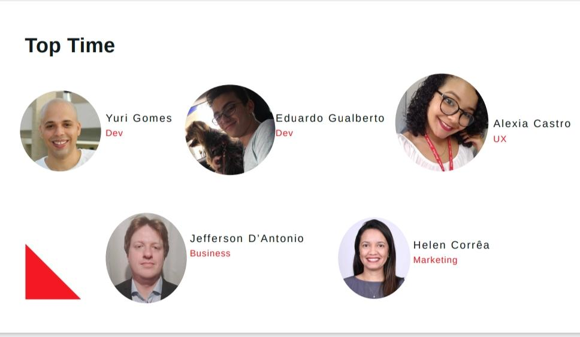

# PROJETO DESENVOLVIDO NO HACKATHON GETNET 10/2020

  

# TIME:

  

# SOBRE:

A TopGrana é um sistema de gestão financeira feita para facilitar a gestão de seu negócio. Nela existem ferramentas para controle de entrada e sada de recursos, acompanhamento de desempenho por meio de gráficos, um facilitador de pagamentos via cartão ou boleto, entre outros. A intenção do produto é servir aquele pequeno empreendedor que, muitas vezes sem poder comprar uma maquininha, acaba abrindo mão de receber pagamentos que não sejam em espécie, além de proporcionar para esse usuário um mecanismo de controle financeiro, assim capacitando-o cada vez mais para evoluir em seu negócio.

# FERRAMENTAS PARA O DESENVOLVIMENTO

## TECNOLOGIAS NO FRONT-END:

-   Vue.JS 2.x.
-   bootstrap-vue
-   typescript vuex, entre outros.

A escolha se deu por conta da demanda por um framework leve, que possa ser usado na rede móvel de um celular sem consumir muitos dados e nem processamento. Além de ser incrívelmente fluído para desenvolvimento e de arquitetura de projeto flexível, questões chave para desenvolvimento em um hackathon.

<b> Obs.: por questões de tempo, foram feitos os layouts apenas para dispositivos móveis, a responsividade para dispositivos com viewports maiores é um 'to do' do projeto. </b>

## TECNNOLGIAS NO BACK-END:

-   Docker
-   PHP 7.4.11
-   MySQL

Tecnologias amplamente utilizadas, que amplo suporte nas comunidades DEV, posibilitando gestão facilitada, otimização de recursos

